# 语音合成大作业作答及说明文档

> 无17 马林 2021010540

## 1.2.1 语音预测模型

<span style="font-size: 20px;">**(1)**</span>

等式两边作Z变换：
$$
E(z)=S(z)-a_1z^{-1}S(z)-a_2z^{-2}S(z)
$$
故传递函数为：
$$
H(z)=\frac{z^2}{z^2-a_1z-a_2}
$$
$a_1=1.3789$， $a_2=-0.9506$ 时，首先由下面的代码求出系统的极点：

```matlab
z = 1;
p = [1, -1.3798, 0.9506];
roots(p);
```

得到$p_1=0.6899 + 0.6889i$， $p_2=0.6899 - 0.6889i$。可见系统有一对共轭极点$p_1$， $p_2$ 且显然系统在原点处有二阶零点。

故共振峰的频率为：
$$
\Omega_0=\arctan\frac{0.6889}{0.6899}\approx\frac{\pi}{4}
$$
这里同时利用后题中出现的$F_s=8000Hz$ 的采样率，一并计算出此时共振峰的模拟频率：
$$
f=\frac{\Omega_0F_s}{2\pi}=1000Hz
$$
然后绘制出系统的零极点图，频率响应和单位样值响应，代码和结果如下所示：

```matlab
zplane(z, p)
freqz(z, p)
impz(z, p)
stem(filter(z, p, [1, zeros(1, 300)]))
title("单位样值响应");
xlabel("n");
ylabel("振幅")
```

<center class="half">
    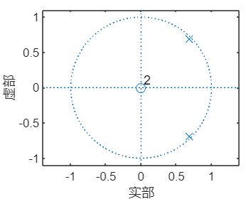
    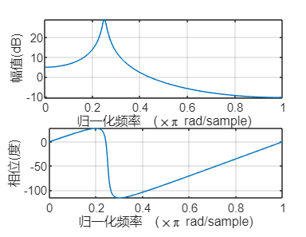 
    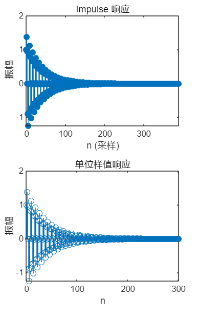
</center>

可见，所绘图像与前面分析结果基本相同，且filter绘制的单位样值响应和`impz`绘制的相同。

<span style="font-size: 20px;">**(3)**</span>

补全代码如下：

```matlab
if n == 27
	% 观察预测系统的零极点图
    zplane(-A, 1)
end
```

运行程序可得：

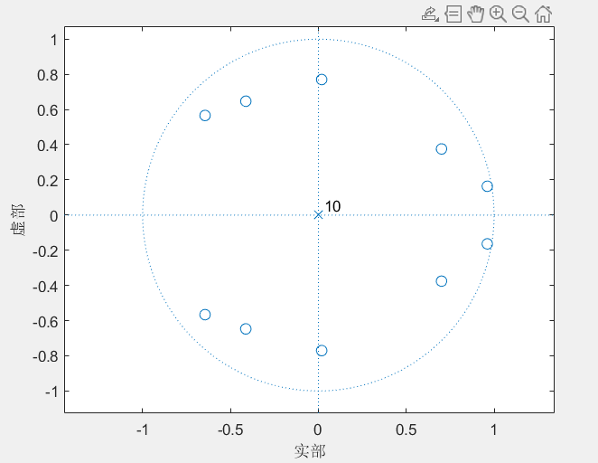

可见预测系统有五对共轭零点，且全部位于单位圆内，并在原点处有一个十阶极点，考虑到预测系统是生成系统的逆系统，可以推测出生成系统应该有五对共轭极点，且全部位于单位圆内，并在原点处有一个十阶零点。

<span style="font-size: 20px;">**(4)**</span>

补全代码如下：

```matlab
% (4) 在此位置写程序，用filter函数s_f计算激励，注意保持滤波器状态
        [exc((n - 1) * FL + 1: n * FL), zi_pre] = filter(-A, 1, s_f, zi_pre);
```

前面出现的`zi_pre`记录滤波器在一段滤波之后的状态，后面出现的`zi_pre`作为函数的参数调整滤波器的初始状态。这就保证了在系数变化的情况下连续滤波时，滤波器的状态是连续不变的。

<span style="font-size: 20px;">**(5)**</span>

补全代码如下：

```matlab
% (5) 在此位置写程序，用filter函数和exc重建语音，注意保持滤波器状态
        [s_rec((n - 1) * FL + 1: n * FL), zi_rec] = ...
            filter(1, -A, exc((n - 1) * FL + 1: n * FL), zi_rec);
```

`zi_rec`与上面(4)中所述的`zi_pre`原理相同，不再赘述。

<span style="font-size: 20px;">**(6)**</span>

添加如下代码：

```matlab
% (6) 在此位置写程序，听一听 s ，exc 和 s_rec 有何区别，解释这种区别
    sound(s);
    sound(exc);
    sound(s_rec);
```

然后试听，就个人感受而言，$s(n)$ 和 $\hat{s}(n)$ 几乎没有任何区别，但是 $\hat{s}(n)$ 的背景噪声似乎稍小一些，而 $e(n)$ 的“电灯比油灯进步多了”声音较小，背景噪声相对较大，且高频分量更为明显。

添加如下代码：

```matlab
subplot(3, 1, 1);
plot((0: L - 1)./Fs, s);
xlabel("Length");
ylabel("$s(n)$", Interpreter="latex");
subplot(3, 1, 2);
plot((0: L - 1)./Fs, exc);
xlabel("Length");
ylabel("$e(n)$", Interpreter="latex");
subplot(3, 1, 3);
plot((0: L - 1)./Fs, s_rec);
xlabel("Length");
ylabel("$\hat{s}(n)$", Interpreter="latex");
```

运行程序可得：

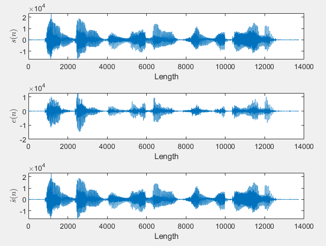

可见，从整体的波形上来看，$s(n)$ 和 $\hat{s}(n)$ 的确几乎没有任何区别，而$e(n)$ 的幅度就要小一些，也出现了一定的失真。

选择图中`Length`从2200到3800的波形，添加如下代码：

```matlab
x = 2200: 3800;
figure
subplot(3, 1, 1);
plot(x./Fs, s(x));
xlabel("Length");
ylabel("$s(n)$", Interpreter="latex");
subplot(3, 1, 2);
plot(x./Fs, exc(x));
xlabel("Length");
ylabel("$e(n)$", Interpreter="latex");
subplot(3, 1, 3);
plot(x./Fs, s_rec(x));
xlabel("Length");
ylabel("$\hat{s}(n)$", Interpreter="latex");
```

运行程序可得：

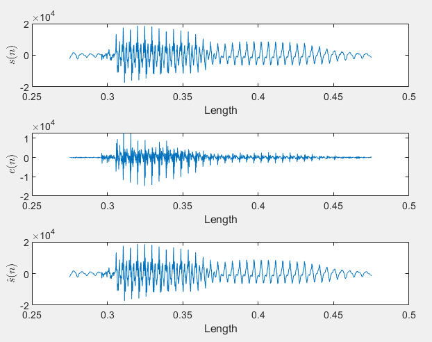

$s(n)$ 和 $\hat{s}(n)$ 几乎没有任何区别，这符合激励经过一个滤波器逆系统再经过该滤波器后会复原的理论依据，而$e(n)$ 的幅度很容易从放大后的图片中看出变得更小了，并且高频分量增多，与听觉感受一致，为了进一步验证这一点，利用`fft`画出这三个信号的频谱图，添加如下代码：

```matlab
s_fft = fft(s);
exc_fft = fft(exc);
s_rec_fft = fft(s_rec);
% 此处通过一答疑坊零字班学长得到正确的频谱图画法，在此对其表示感谢
freq = Fs * (0: (L / 2)) / L;
figure;
subplot(3, 1, 1);
plot(freq, abs(s_fft(1: L / 2 + 1)));
ylabel("$s(n)$", Interpreter="latex");

subplot(3, 1, 2);
plot(freq, abs(exc_fft(1: L / 2 + 1)));
ylabel("$e(n)$", Interpreter="latex");

subplot(3, 1, 3);
plot(freq, abs(s_rec_fft(1: L / 2 + 1)));
ylabel("$\hat{s}(n)$", Interpreter="latex");
```

运行程序可得：

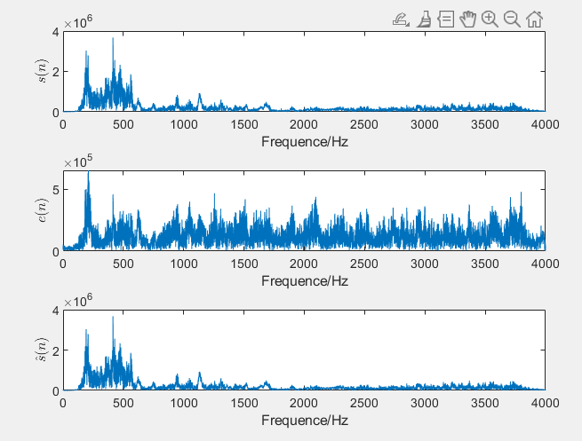

可见，与我们的猜测一致，$e(n)$ 的高频分量很多。

## 1.2.2 语音合成模型

<span style="font-size: 20px;">**(7)**</span>

规定采样率$F_s=8kHz$ ，信号的频率$f=200Hz$ ，持续时间$t=1s$ 则可以得出：
$$
N=\frac{F_s}{f}=40\\
NS=tf=200
$$
添加如下单位样值串生成代码：

```matlab
function s = unitSampleSignal(Fs, freq, duration)
    N = round(Fs / freq);
    NS = round(freq * duration);
    % 首先为s开辟足够大的空间，减少运行时动态分配的时间损耗，后续添加代码同理，不再赘述
    s = zeros(1, round(Fs * duration));
    for k = 0: NS - 1
        s(k * N + 1) = 1;
    end
end
```

`k`即公式中的`i`，避免与MATLAB内定的变量`i`（虚部单位）混淆。添加如下代码，生成对应的单位样值串并试听：

```matlab
sound(unitSampleSignal(8000, 200, 1));
sound(unitSampleSignal(8000, 300, 1));
```

就个人感受而言，300Hz的单位样值串音调更高，类似于汽笛声，200Hz的单位样值串音调更低。

<span style="font-size: 20px;">**(8)**</span>

添加如下的基音生成代码：

```matlab
function s = pitchGenerating(Fs, duration)
    len = round(Fs * duration);
    s = zeros(1, len);
    k = 1;
    while k <= len
        s(k) = 1;
        % 直接通过计算定位到有脉冲的段序号，并将该段的信号值记为1，代表脉冲。该实现方法会导致后续与原题中所给待补充代码出现一定的冲突，但考虑到这种实现更为快速简洁，故采用这种方法，后不再赘述。
        m = ceil(k / Fs / 0.01);
        k = k + 80 + 5 * mod(m, 50);
    end
end
```

添加如下代码，生成对应的信号并试听：

```matlab
e = pitchGenerating(8000, 1);
L = length(e);
sound(e);
```

就个人感受而言，信号的声音类似于两次从嘴唇发出的`pzipzi`声。

<span style="font-size: 20px;">**(9)**</span>

添加如下代码，将激励通过该系统生成输出信号并试听：

```matlab
s = filter(z, p, e);
sound(s);
```

就个人感觉而言，信号的声音类似于两次打嗝声，相对于激励信号而言，输出信号的高频分量应该更少。另外，根据(1)的分析，输出信号的频谱在1000Hz左右应该有一个峰值。

为对激励信号和输出信号有更多的了解并验证上面的猜想，添加如下代码，画出激励信号和输出信号的波形，并作出其频谱图：

```matlab
Fs = 8000;
figure;
subplot(2, 1, 1);
plot(e);
xlabel("Length");
ylabel("$e(n)$", Interpreter="latex");
subplot(2, 1, 2);
plot(s);
xlabel("Length");
ylabel("$s(n)$", Interpreter="latex");

e_fft = fft(e);
s_fft = fft(s);
freq = Fs * (0: (L / 2)) / L;

figure;
subplot(2, 1, 1);
plot(freq, abs(e_fft(1: L / 2 + 1)));
xlabel("Frequence/Hz");
ylabel("$e(n)$", Interpreter="latex");

subplot(2, 1, 2);
plot(freq, abs(s_fft(1: L / 2 + 1)));
xlabel("Frequence/Hz");
ylabel("$s(n)$", Interpreter="latex");
```

运行程序可得：

<center class="half">
    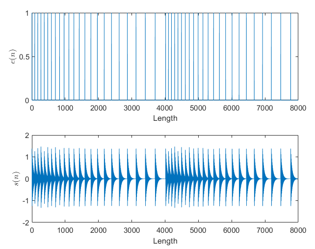
    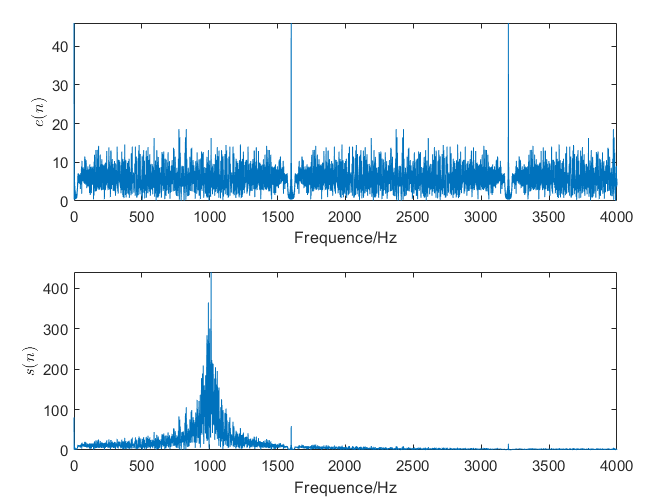 
</center>

可见，输出信号的确更为平缓，高频分量更少，并在1000Hz的位置有一个输出峰。另外，还可以从图中看出，基音频率大概在1600Hz附近，对应地，在3200Hz等处会有基音的高次谐波分量。

<span style="font-size: 20px;">**(10)**</span>

补全开头处遗落的合成滤波器的状态，并将激励信号的初始位置设置至与窗长和帧长对应，即从第三帧开始分析：

```matlab
zi_syn = zeros(P, 1);
k = 2 * FL + 1;
```

由于脉冲的幅度为1而增益为G，故激励信号的幅度为G。补全代码如下：

```matlab
% (10) 在此位置写程序，生成合成激励，并用激励和filter函数产生合成语音
        while k <= n * FL
            exc_syn(k) = G;
            k = k + PT;
        end
        [s_syn((n - 1) * FL + 1: n * FL), zi_syn] = ...
            filter(1, -A, exc_syn((n - 1) * FL + 1: n * FL), zi_syn);
```

添加如下代码试听：

```matlab
sound(s_syn);
```

就个人感觉而言，合成的语音背景噪声更小，高频分量应该更低，且声音听起来更为纯粹。

为验证上述猜想，添加如下代码，画出$s(n)$ 和$s_{syn}$ 的波形和频谱图：

```matlab
figure
subplot(2, 1, 1);
plot((0: L - 1)./Fs, s);
xlabel("Length");
ylabel("$s(n)$", Interpreter="latex");
subplot(2, 1, 2);
plot((0: L - 1)./Fs, s_syn);
xlabel("Length");
ylabel("$s_{syn}(n)$", Interpreter="latex");

s_syn_fft = fft(s_syn);
figure;
subplot(2, 1, 1);
plot(freq, abs(s_fft(1: L / 2 + 1)));
xlabel("Frequence/Hz");
ylabel("$s(n)$", Interpreter="latex");

subplot(2, 1, 2);
plot(freq, abs(s_syn_fft(1: L / 2 + 1)));
xlabel("Frequence/Hz");
ylabel("$s_{syn}(n)$", Interpreter="latex");
```

运行程序可得：

<center class="half">
    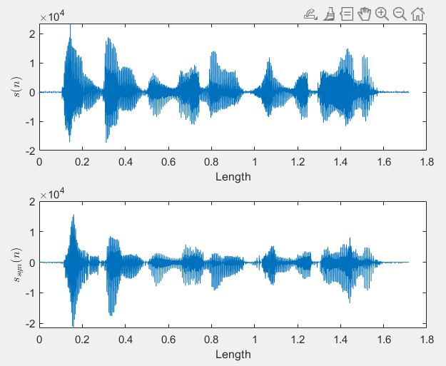
    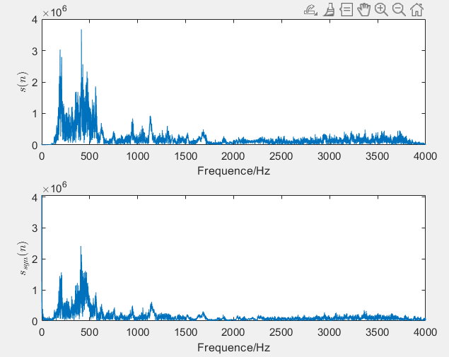 
</center>

可见与猜想基本一致。

## 1.2.3 变速不变调

<span style="font-size: 20px;">**(11)**</span>

补全开头处遗落的合成滤波器的状态，并将激励信号的初始位置设置至与窗长和帧长对应，即从第三帧开始分析：

```matlab
zi_syn_v = zeros(P, 1);
FL_v = 2 * FL;
k_v = 2 * FL + 1;
```

补全代码如下，合成变速不变调的语音并试听：

```matlab
% (11) 不改变基音周期和预测系数，将合成激励的长度增加一倍，再作为filter的输入得到新的合成语音，听一听是不是速度变慢了，但音调没有变。
        while k_v <= n * FL_v
            exc_syn_v(k_v) = G;
            k_v = k_v + PT;
        end
        [s_syn_v((n - 1) * FL_v + 1: n * FL_v), zi_syn_v] = ...
            filter(1, -A, exc_syn_v((n - 1) * FL_v + 1: n * FL_v), zi_syn_v);
```

就个人感受而言，合成语音就是原始语音变速不变调的结果，由于速度减半，原有频率峰分量应该会相应降低，即语音的频率特性会稍有弱化，但是频率点不会发生偏移。这一点将在实现变调不变速之后一起验证。

## 1.2.4 变调不变速

<span style="font-size: 20px;">**(12)**</span>

题中并没有给出共振峰频率提高时极点幅度的变化要求，故下面的求解中假设极点的幅度不变，即极点仅有相位角改变。极点幅度变化的情况将会在最后讨论。基于此思想，新的 $p_1$ 和 $p_2$ 可以由如下关系式求出：
$$
p_{new}=pe^{\vartriangle\varphi\cdot sign(p_{imag})i}
$$
其中，$p_{new}$ 为新的极点，$p$ 为原极点，$\vartriangle\varphi$ 为极点旋转角度的绝对值，$sign(p_{imag})$ 为原极点虚部的符号，这一项可以保证共轭的极点旋转后仍然共轭，$i$ 为虚数单位。

编写如下函数：

```matlab
function newP = rotAngle(v, deltaAngle)
    p = roots(v);
    newP = poly(p .* exp(deltaAngle * sign(imag(p)) * 1i)) * v(1);
end
```

该函数要求输入的参数`v`严格满足传递函数的分母按`z`的降幂排列，且保留第一项的原始系数，换言之，分母中的每一项都可以被一整除。`deltaAngle`是所旋转角度的绝对值。

运行程序可得：

新的$a_1=-1.2083$ ，$a_2=0.9506$ 。

添加如下代码，观察新极点对应的频率响应：

```matlab
freqz(z, newP)
```

运行程序可得：

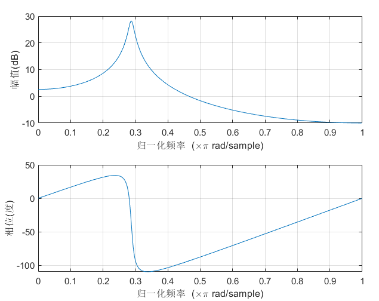

可见，归一化频率确实在$0.2875\pi$ 附近，极点实现了正确旋转。

<span style="font-size: 20px;">**(13)**</span>

补全开头处遗落的合成滤波器的状态，并将激励信号的初始位置设置至与窗长和帧长对应，即从第三帧开始分析，并在循环之中将预测系数进行旋转：

```matlab
zi_syn_t = zeros(P, 1);
k_t = 2 * FL + 1;
	% ...在循环中...
	newA = rotAngle(A, 2 * pi * 150 / Fs);
```

重新定义一个在初始化时与变量`k`相同的`k_t`是因为原变量`k`在循环时已经发生了改变，并且两个变量便于互相区分。

补全代码如下，合成变调不变速的语音并试听：

```matlab
% (13) 将基音周期减小一半，将共振峰频率增加150Hz，重新合成语音，听听是啥感受～
while k_t <= n * FL
            exc_syn_t(k_t) = G;
            k_t = k_t + round(PT / 2);
        end
        [s_syn_t((n - 1) * FL + 1: n * FL), zi_syn_t] = ...
            filter(1, -newA, exc_syn_t((n - 1) * FL + 1: n * FL), zi_syn_t);
```

就个人感受而言，合成的语音就是原始语音变调不变速的结果，由于音调变高，声音的波形应该更为密集，高频分量也会相应增多，声音类似女音。

为进一步了解合成语音的变化，画出三种波形的对比图并利用`FFT`画出其频谱，添加代码如下：

```matlab
    freqv = Fs * (0: L) / (2 * L);
	s_syn_t_fft = fft(s_syn_t);
    s_syn_v_fft = fft(s_syn_v);
    figure
    subplot(3, 1, 1);
    plot((0: L - 1)./Fs, s);
    xlabel("Length");
    ylabel("$s(n)$", Interpreter="latex");
    subplot(3, 1, 2);
    plot((0: 2 * L - 1)./Fs, s_syn_v);
    xlabel("Length");
    ylabel("$s_{synv}(n)$", Interpreter="latex");
    subplot(3, 1, 3);
    plot((0: L - 1)./Fs, s_syn_t);
    xlabel("Length");
    ylabel("$s_{synt}(n)$", Interpreter="latex");

    figure
    subplot(3, 1, 1);
    plot(freq, abs(s_fft(1: L / 2 + 1)));
    xlabel("Frequence/Hz");
    ylabel("$s(n)$", Interpreter="latex");
    subplot(3, 1, 2);
    plot(freqv, abs(s_syn_v_fft(1: L + 1)));
    xlabel("Frequence/Hz");
    ylabel("$s_{synv}(n)$", Interpreter="latex");
    subplot(3, 1, 3);
    plot(freq, abs(s_syn_t_fft(1: L / 2 + 1)));
    xlabel("Frequence/Hz");
    ylabel("$s_{synt}(n)$", Interpreter="latex");
```

运行程序可得：

<center class="half">
    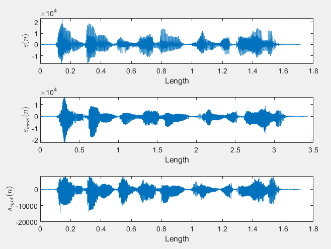
    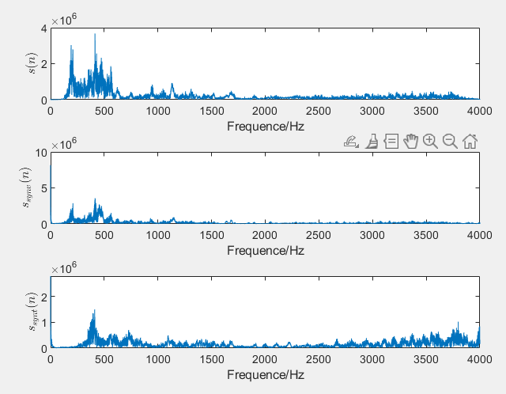 
</center>

可见，波形基本应证了前面的感受和猜想。

## 1.2.5 探究和补充

在1.2.4(12)中，我们留下了铺垫，如果极点旋转时，极点的幅度一起发生了改变，会发生什么呢？一个很直观的想法是，极点的幅度增大（或减小），在合成语音的过程中，输出信号的幅度会对应地减小（或增大），而其频点则不会发生偏移。在本段，将对此以两个幅度变大点和两个幅度变小点进行探究。

对于极点旋转部分，原代码无需进行进行更改，只需要对`v`进行等比例增大或缩小即可，无需验证便可以肯定的是，共振峰频率不会发生改变。

至于语音的合成部分，添加如下代码：

```matlab
% ...在循环中...
	newA = rotAngle(A, 2 * pi * 150 / Fs);
    newAL1 = rotAngle(1.1 * A, 2 * pi * 150 / Fs);
    newAL2 = rotAngle(1.2 * A, 2 * pi * 150 / Fs);
    newAS1 = rotAngle(0.9 * A, 2 * pi * 150 / Fs);
    newAS2 = rotAngle(0.8 * A, 2 * pi * 150 / Fs);
	while k_t <= n * FL
        exc_syn_t(k_t) = G;
        exc_syn_tL1(k_t) = G;
        exc_syn_tL2(k_t) = G;
        exc_syn_tS1(k_t) = G;
        exc_syn_tS2(k_t) = G;
        k_t = k_t + round(PT / 2);
    end
    [s_syn_t((n - 1) * FL + 1: n * FL), zi_syn_t] = ...
        filter(1, -newA, exc_syn_t((n - 1) * FL + 1: n * FL), zi_syn_t);

    [s_syn_tL1((n - 1) * FL + 1: n * FL), zi_syn_tL1] = ...
        filter(1, -newAL1, exc_syn_tL1((n - 1) * FL + 1: n * FL), zi_syn_tL1);

    [s_syn_tL2((n - 1) * FL + 1: n * FL), zi_syn_tL2] = ...
        filter(1, -newAL2, exc_syn_tL2((n - 1) * FL + 1: n * FL), zi_syn_tL2);

    [s_syn_tS1((n - 1) * FL + 1: n * FL), zi_syn_tS1] = ...
        filter(1, -newAS1, exc_syn_tS1((n - 1) * FL + 1: n * FL), zi_syn_tS1);

    [s_syn_tS2((n - 1) * FL + 1: n * FL), zi_syn_tS2] = ...
        filter(1, -newAS2, exc_syn_tS2((n - 1) * FL + 1: n * FL), zi_syn_tS2);

% 添加如下代码，完成语音信号及其频谱的绘图：
s_syn_t_fft = fft(s_syn_t);
s_syn_tL1_fft = fft(s_syn_tL1);
s_syn_tL2_fft = fft(s_syn_tL2);
s_syn_tS1_fft = fft(s_syn_tS1);
s_syn_tS2_fft = fft(s_syn_tS2);
figure
subplot(5, 1, 1);
plot((0: L - 1)./Fs, s_syn_t);
xlabel("Length");
ylabel("$s_{synt}$", Interpreter="latex");
subplot(5, 1, 2);
plot((0: L - 1)./Fs, s_syn_tL1);
xlabel("Length");
ylabel("$s_{syntL1}(n)$", Interpreter="latex");
subplot(5, 1, 3);
plot((0: L - 1)./Fs, s_syn_tL2);
xlabel("Length");
ylabel("$s_{syntL2}(n)$", Interpreter="latex");
subplot(5, 1, 4);
plot((0: L - 1)./Fs, s_syn_tS1);
xlabel("Length");
ylabel("$s_{syntS1}(n)$", Interpreter="latex");
subplot(5, 1, 5);
plot((0: L - 1)./Fs, s_syn_tS2);
xlabel("Length");
ylabel("$s_{syntS2}(n)$", Interpreter="latex");

figure
subplot(5, 1, 1);
plot(freq, abs(s_syn_t_fft(1: L / 2 + 1)));
xlabel("Frequence/Hz");
ylabel("$s_{synt}$", Interpreter="latex");
subplot(5, 1, 2);
plot(freq, abs(s_syn_tL1_fft(1: L / 2 + 1)));
xlabel("Frequence/Hz");
ylabel("$s_{syntL1}(n)$", Interpreter="latex");
subplot(5, 1, 3);
plot(freq, abs(s_syn_tL2_fft(1: L / 2 + 1)));
xlabel("Frequence/Hz");
ylabel("$s_{syntL2}(n)$", Interpreter="latex");
subplot(5, 1, 4);
plot(freq, abs(s_syn_tS1_fft(1: L / 2 + 1)));
xlabel("Frequence/Hz");
ylabel("$s_{syntS1}(n)$", Interpreter="latex");
subplot(5, 1, 5);
plot(freq, abs(s_syn_tS2_fft(1: L / 2 + 1)));
xlabel("Frequence/Hz");
ylabel("$s_{syntS2}(n)$", Interpreter="latex");
```

运行程序可得：

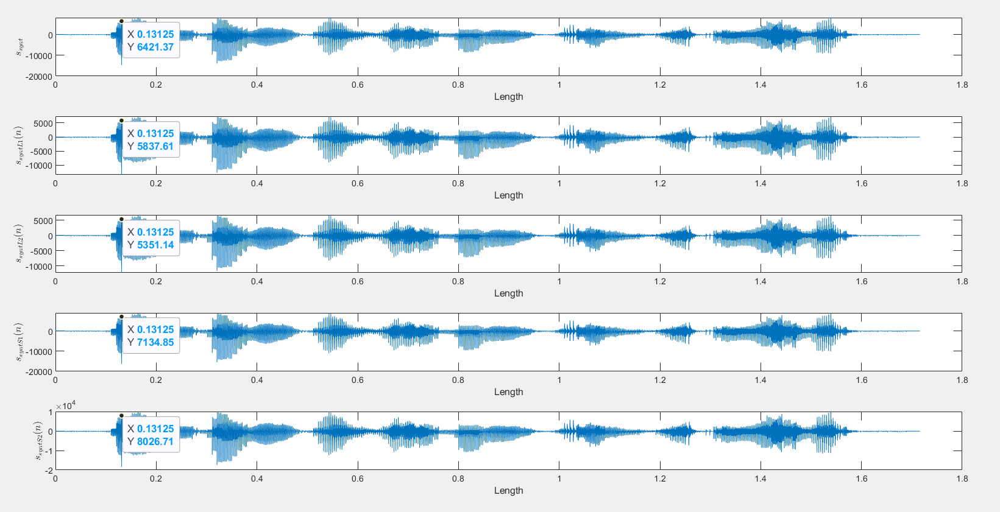

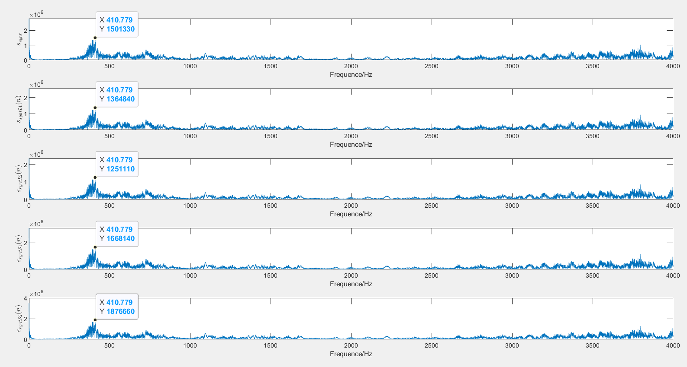

可见，波形和频谱与我们预想的一致，极点的幅度越小，波形的幅度越大；极点的幅度越大，波形的幅度越小，而频点不发生偏移。
